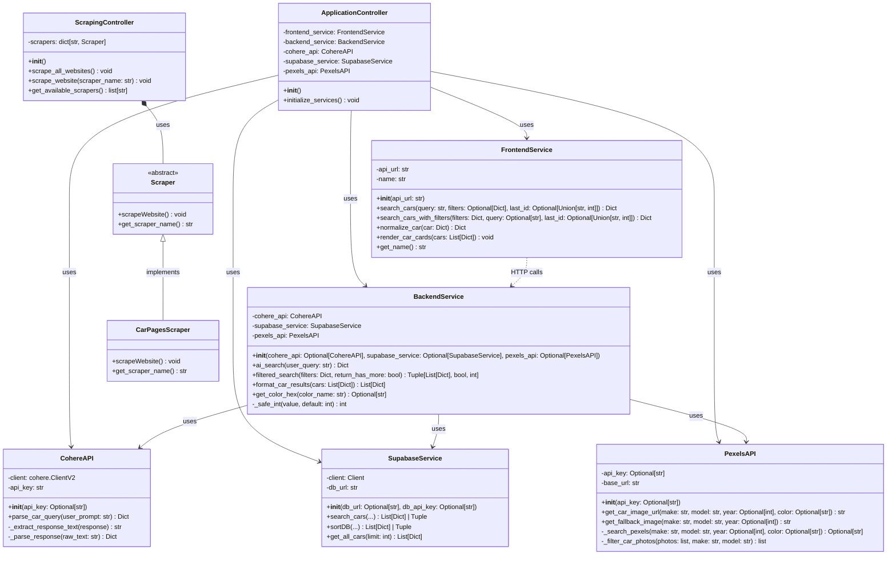

# Class Diagram for ReCarmend System

## UML Class Diagram (PlantUML Format)

```plantuml
@startuml
!theme plain

' Abstract Base Class
abstract class Scraper {
    + {abstract} scrapeWebsite() : void
    + {abstract} get_scraper_name() : str
}

' Service Classes
class FrontendService {
    - api_url : str
    - name : str
    + __init__(api_url: str = "http://localhost:5001")
    + search_cars(query: str, filters: Optional[Dict] = None, last_id: Optional[Union[str, int]] = None) : Dict[str, Any]
    + search_cars_with_filters(filters: Dict, query: Optional[str] = None, last_id: Optional[Union[str, int]] = None) : Dict[str, Any]
    + normalize_car(car: Dict) : Dict
    + render_car_cards(cars: List[Dict]) : void
    + get_name() : str
}

class BackendService {
    - cohere_api : CohereAPI
    - supabase_service : SupabaseService
    - pexels_api : PexelsAPI
    + __init__(cohere_api: Optional[CohereAPI] = None, supabase_service: Optional[SupabaseService] = None, pexels_api: Optional[PexelsAPI] = None)
    + ai_search(user_query: str) : Dict
    + filtered_search(filters: Dict, return_has_more: bool = True) : Tuple[List[Dict], bool, int]
    + format_car_results(cars: List[Dict]) : List[Dict]
    + get_color_hex(color_name: str) : Optional[str]
    - _safe_int(value, default: int = 0) : int
}

class CohereAPI {
    - client : cohere.ClientV2
    - api_key : str
    + __init__(api_key: Optional[str] = None)
    + parse_car_query(user_prompt: str) : Dict[str, any]
    - _extract_response_text(response) : str
    - _parse_response(raw_text: str) : Dict[str, any]
}

class PexelsAPI {
    - api_key : Optional[str]
    - base_url : str
    + __init__(api_key: Optional[str] = None)
    + get_car_image_url(make: str, model: str, year: Optional[int] = None, color: Optional[str] = None) : str
    + get_fallback_image(make: str, model: str, year: Optional[int] = None) : str
    - _search_pexels(make: str, model: str, year: Optional[int] = None, color: Optional[str] = None) : Optional[str]
    - _filter_car_photos(photos: list, make: str, model: str) : list
}

class SupabaseService {
    - client : Client
    - db_url : str
    + __init__(db_url: Optional[str] = None, db_api_key: Optional[str] = None)
    + search_cars(maximum_price: Optional[int] = None, maximum_mileage: Optional[int] = None, color: Optional[str] = None, make: Optional[str] = None, model: Optional[str] = None, min_year: Optional[int] = None, max_year: Optional[int] = None, car_type: Optional[str] = None, limit: int = 10, return_has_more: bool = False)
    + sortDB(maximum_price: Optional[int] = None, maximum_mileage: Optional[int] = None, color: Optional[str] = None, make: Optional[str] = None, model: Optional[str] = None, min_year: Optional[int] = None, max_year: Optional[int] = None, car_type: Optional[str] = None, return_has_more: bool = False)
    + get_all_cars(limit: int = 10) : List[Dict]
}

class ScrapingController {
    - scrapers : dict[str, Scraper]
    + __init__()
    + scrape_all_websites() : void
    + scrape_website(scraper_name: str) : void
    + get_available_scrapers() : list[str]
}

class CarPagesScraper {
    + scrapeWebsite() : void
    + get_scraper_name() : str
}

class ApplicationController {
    - frontend_service : FrontendService
    - backend_service : BackendService
    - cohere_api : CohereAPI
    - supabase_service : SupabaseService
    - pexels_api : PexelsAPI
    + __init__()
    + initialize_services() : void
}

' Relationships
Scraper <|-- CarPagesScraper
ScrapingController "1" *-- "many" Scraper : uses
ApplicationController "1" --> "1" FrontendService : uses
ApplicationController "1" --> "1" BackendService : uses
ApplicationController "1" --> "1" CohereAPI : uses
ApplicationController "1" --> "1" SupabaseService : uses
ApplicationController "1" --> "1" PexelsAPI : uses
BackendService "1" --> "1" CohereAPI : uses
BackendService "1" --> "1" SupabaseService : uses
BackendService "1" --> "1" PexelsAPI : uses
FrontendService ..> BackendService : calls via HTTP

note right of Scraper
  Abstract base class
  Strategy Pattern implementation
end note

note right of BackendService
  Orchestrates Cohere, Supabase, Pexels
  Main business logic coordinator
end note

note right of FrontendService
  Represents React frontend
  For sequence diagram purposes
end note

note right of ApplicationController
  Main application controller
  Initializes all services
  Represented by api_server.py
end note

@enduml
```

## Class Diagram (Mermaid Format)

## Detailed Class Descriptions

### 1. Scraper (Abstract Base Class)
- **Purpose**: Defines interface for all web scrapers
- **Pattern**: Strategy Pattern / Interface Pattern
- **Location**: `Webscraping/scraper_interface.py`
- **Relationships**: 
  - Parent of `CarPagesScraper`

### 2. FrontendService
- **Purpose**: Represents frontend/UI component for sequence diagrams
- **Location**: `Controller/services/frontend_service.py`
- **Note**: Actual frontend is TypeScript; this is for architecture representation

### 3. BackendService
- **Purpose**: Orchestrates all external services (Cohere, Supabase, Pexels)
- **Location**: `Controller/services/backend_service.py`
- **Relationships**:
  - Composition: Uses `CohereAPI`, `SupabaseService`, `PexelsAPI`

### 4. CohereAPI
- **Purpose**: Handles Cohere AI natural language processing
- **Location**: `Controller/services/cohere_service.py`
- **Responsibilities**: Parse user queries into structured parameters

### 5. PexelsAPI
- **Purpose**: Fetches car images from Pexels API
- **Location**: `Controller/services/pexels_service.py`
- **Responsibilities**: Image search and fallback image handling

### 6. SupabaseService
- **Purpose**: Handles database operations with Supabase
- **Location**: `Controller/services/supabase_service.py`
- **Responsibilities**: Query car listings from database

### 7. ScrapingController
- **Purpose**: Manages scraping operations
- **Location**: `Controller/scraping_controller.py`
- **Relationships**:
  - Aggregation: Uses multiple `Scraper` implementations

### 8. CarPagesScraper
- **Purpose**: Implements scraping for CarPages.ca
- **Location**: `Webscraping/carpages_scraper.py`
- **Relationships**: Implements `Scraper` interface

### 9. ApplicationController
- **Purpose**: Main application controller that orchestrates all services
- **Location**: Represented by `Controller/api_server.py` initialization
- **Relationships**: Uses all service classes (FrontendService, BackendService, CohereAPI, SupabaseService, PexelsAPI)

## Relationships Summary

1. **Inheritance**: `CarPagesScraper` inherits from `Scraper`
2. **Composition**: `BackendService` composes `CohereAPI`, `SupabaseService`, and `PexelsAPI`
3. **Composition**: `ApplicationController` composes all service classes
4. **Aggregation**: `ScrapingController` aggregates multiple `Scraper` instances
5. **Dependency**: `FrontendService` depends on `BackendService` (via HTTP calls)

## Design Patterns Used

1. **Strategy Pattern**: `Scraper` interface with multiple implementations
2. **Service Layer Pattern**: Separate service classes for each external API
3. **Facade Pattern**: `BackendService` provides simplified interface to multiple services
4. **Dependency Injection**: Services can be injected into `BackendService` constructor

