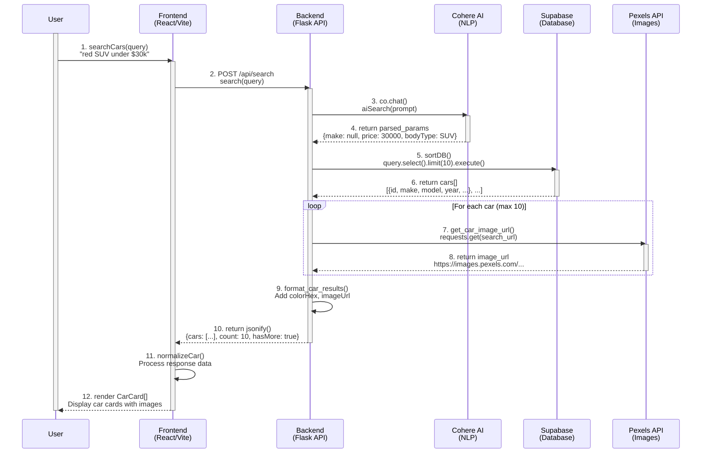
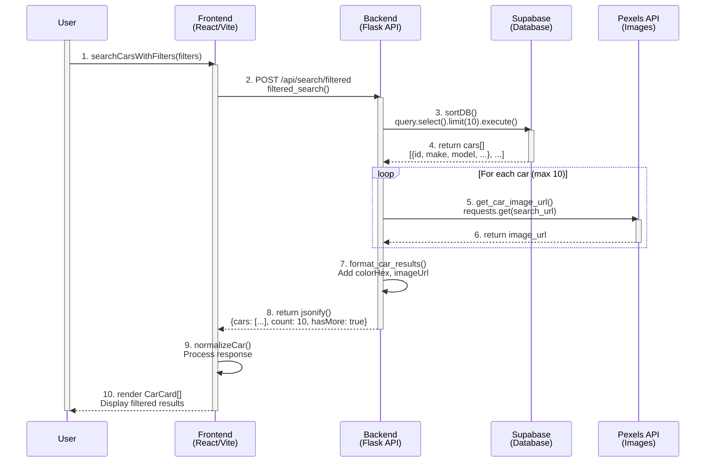

# ReCarmend System Sequence Diagram

## Mermaid Format (for Figma import or recreation)

## Alternative: Filter-Based Search Flow

## Components Summary

**Frontend (React/Vite):**
- User interface
- Search input & filters
- Car card display
- API service layer

**Backend (Flask API):**
- REST API endpoints
- Request processing
- Data formatting
- Image fetching orchestration

**Cohere AI:**
- Natural language processing
- Query parsing
- Parameter extraction

**Supabase:**
- PostgreSQL database
- Car listings storage
- Query execution
- Data filtering

**Pexels API:**
- Image search
- Car photo retrieval
- Image URL generation

## Key Rules Applied:
- ✅ Function calls use solid arrows (→)
- ✅ Return values use dotted arrows (-->>)
- ✅ User lifeline spans entire diagram (activate/deactivate)
- ✅ All components have activation boxes when active
- ✅ Loop notation for repeated operations
- ✅ Self-calls shown for internal processing
